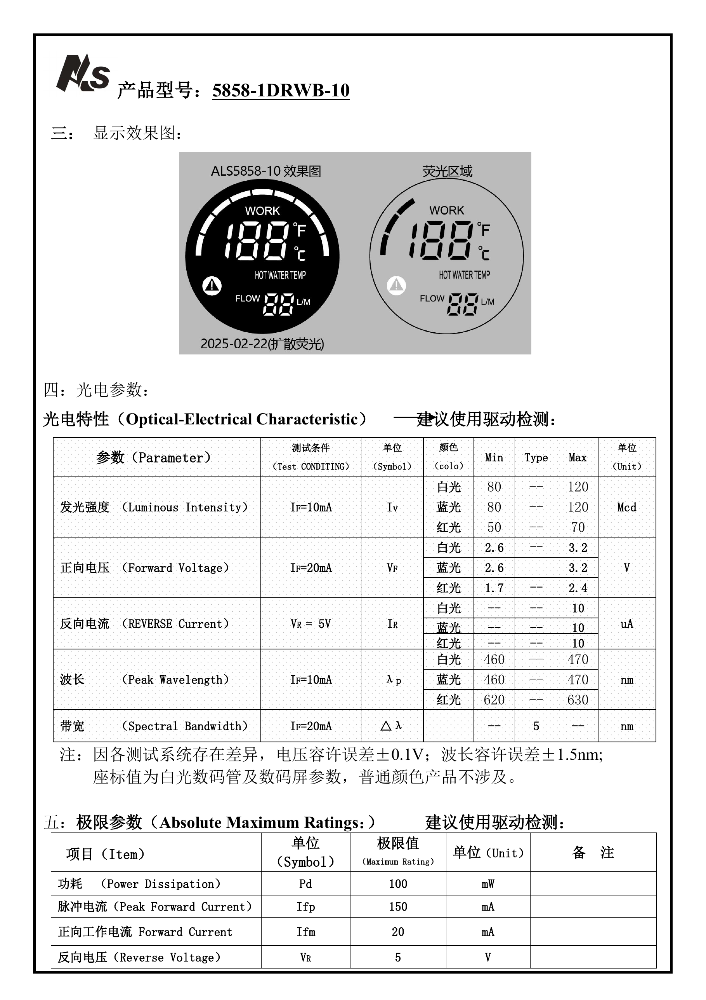

# 硬件资料说明

`docs/` 保存项目所用器件的规格书、BOM 和 STM32C562 官方资料。KiCad 工程及详细电路说明位于 [`pcb/ssd/`](../pcb/ssd/README.md)。

  

当前样板已经完成供电、MCU、I²C、HT16K33、按键和圆屏点亮验证。照片与视频反映的是显示演示固件运行效果；NTC 和流量传感器的真实采集功能仍待固件接入。

## 主要器件资料

| 文件 | 内容 |
| --- | --- |
| `180长规格书(1).pdf` | 50kΩ NTC，B25/50=3950K，−30～105℃ |
| `BTL-004A涡轮霍尔规格书(1).pdf` | 霍尔流量传感器，DC 4.5～24V，标称关系 F=11Q |
| `20250303远帆5858-1DRWB-10(1).pdf` | 58mm 共阴圆形 LED 屏，6 个公共端、10 条段线 |
| `BOM.csv` | 器件参数、封装和采购型号 |
| `STM32C562CET6_官方资料包_2026-09-16/` | 数据手册、参考手册、硬件指南、勘误和官方开发板原理图 |
| `media/` | 实物照片、演示视频和显示屏规格书重点页 |

## 硬件概要

| 模块 | 设计 |
| --- | --- |
| MCU | STM32C562CET6，LQFP48 |
| 3.3V | AP63203WU-7 固定输出同步降压 |
| 5V | AP63205WU-7 固定输出同步降压 |
| 温度 | NTC 分压、RC 滤波、BAV199 钳位后进入 PA0 |
| 流量 | 5V 霍尔脉冲经 SN74LVC1G17 转换为 3.3V 信号 |
| 显示 | HT16K33 驱动 5858-1DRWB-10 圆屏 |
| 总线 | BSS138 双向 I²C 电平转换 |
| 时钟 | 24MHz ABM8 无源晶振 |
| 调试 | J-Link SWD，JST XH 4P 接口 |

J101 为 C668623 6P Type-C，仅用于 5V 供电，不连接 USB 数据。`VIN_SYS` 后级电路采用 5～12V 器件，但 12V 不可从 J101 输入。

## 设计文档

- [项目总览](../README.md)
- [固件与显示演示](../code/README.md)
- [KiCad 工程说明](../pcb/ssd/README.md)
- [电路设计说明](../pcb/ssd/docs/DESIGN_NOTES.md)
- [STM32C562 最小系统](../pcb/ssd/docs/C562_MIGRATION.md)
- [晶振与封装](../pcb/ssd/docs/HSE_FOOTPRINT_A2.md)
- [MCU 封装尺寸图](../pcb/ssd/review/mcu_footprint_dimensioned.pdf)
- [圆屏 1:1 对位图](../pcb/ssd/review/display_footprint_1to1.pdf)

## 实物与演示

| 内容 | 入口 |
| --- | --- |
| 成品板点亮照片 | [查看图片](media/photos/assembled-board-powered.jpg) |
| 焊接完成的 PCB 正面 | [查看图片](media/photos/assembled-board-front.jpg) |
| 暗环境显示效果 | [查看图片](media/photos/display-lit-dark.jpg) |
| 动态显示演示 | [播放 H.264 MP4](media/video/display-demo.mp4) |
| 全部媒体说明 | [照片与视频索引](media/README.md) |

显示屏规格书中的外形、矩阵与光电参数重点页也提供了便于在线查看的图片版本：

| 外形尺寸与 LED 矩阵 | 显示效果与光电参数 |
| --- | --- |
|  |  |

图片仅用于快速预览，设计取值仍以原始 [`20250303远帆5858-1DRWB-10(1).pdf`](20250303远帆5858-1DRWB-10%281%29.pdf) 为准。

## 主要数据关系

- NTC 分压电阻：49.9kΩ / 0.1%。
- NTC 阻值：`Rntc = 49.9k × (Vref / Vadc - 1)`。
- 流量换算：`Q = F / 11`，Q 的单位为 L/min。
- 累计流量：传感器标称 660 个脉冲/L。
- HT16K33 7 位 I²C 地址：`0x70`。
- SWD 接口：1=VREF、2=SWDIO、3=SWCLK、4=GND。
