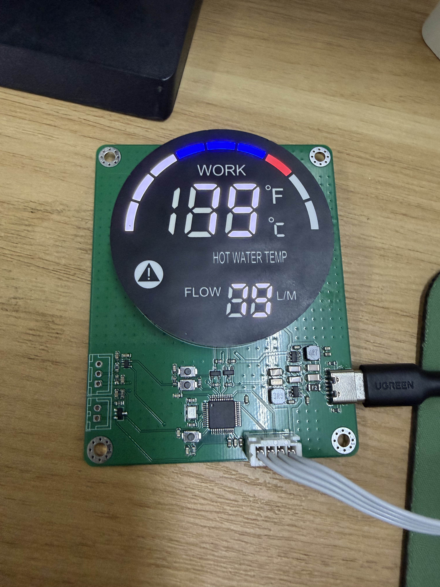
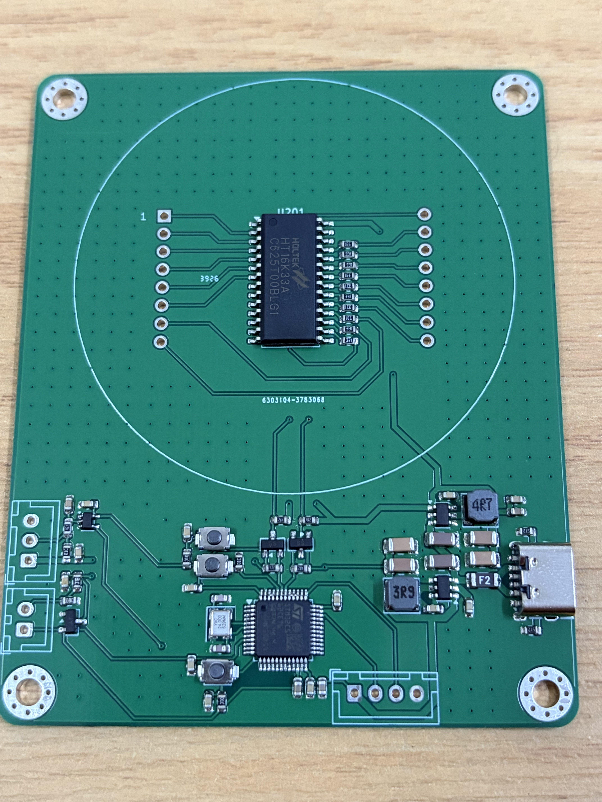
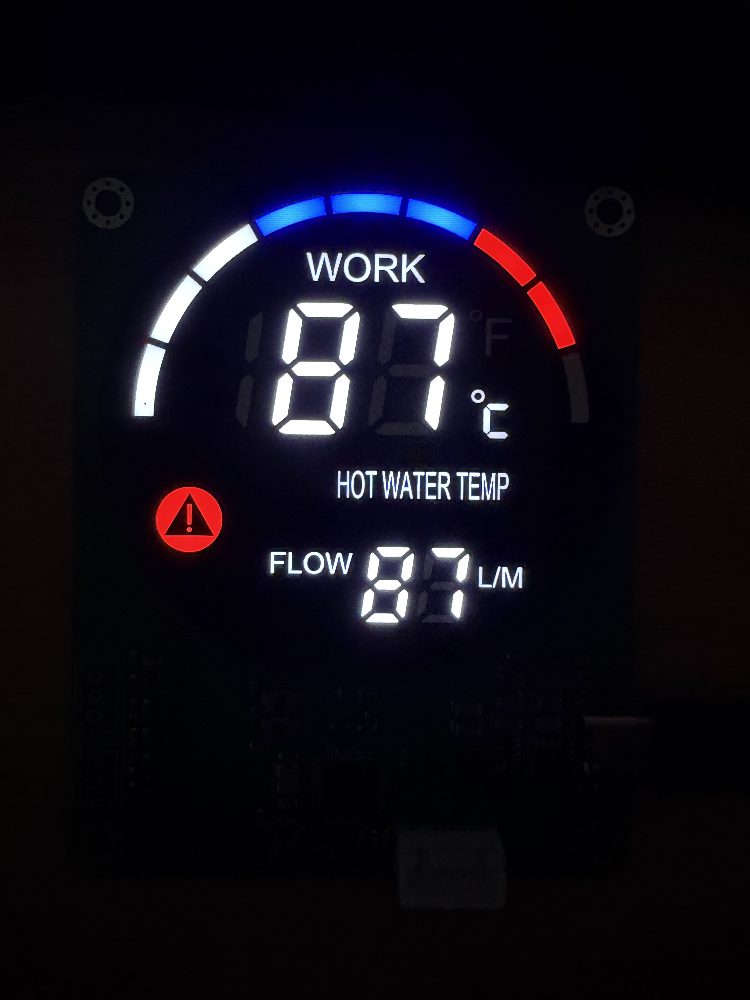
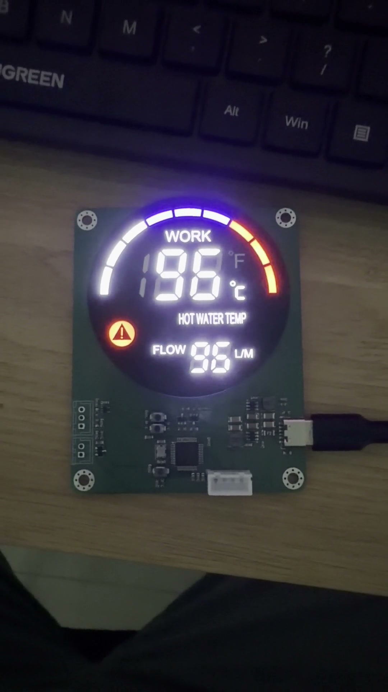

# 项目照片与视频

本目录集中保存 STM32 Sensor Display 的样板照片、显示演示视频和从器件规格书导出的在线预览图。媒体用于项目展示、装配核对和功能记录；工程尺寸与电气参数仍以 KiCad 文件及原始规格书为准。

## 实物照片

| 文件 | 内容 |
| --- | --- |
| [`photos/assembled-board-powered.jpg`](photos/assembled-board-powered.jpg) | 圆屏已安装、Type-C 供电、显示点亮的整板照片 |
| [`photos/assembled-board-front.jpg`](photos/assembled-board-front.jpg) | 未安装圆屏时的 PCB 正面，可查看主要器件与布线 |
| [`photos/display-lit-dark.jpg`](photos/display-lit-dark.jpg) | 暗环境下的数字、图标和环形 LED 显示效果 |

| 整板点亮 | PCB 正面 | 暗环境显示 |
| --- | --- | --- |
|  |  |  |

## 演示视频

  

- [`video/display-demo.mp4`](video/display-demo.mp4)：H.264/AAC 兼容版，1080×1920、30fps，适合 GitHub 下载后在常见浏览器和播放器中观看。
- [`video/display-demo-original-hevc.mp4`](video/display-demo-original-hevc.mp4)：相机原始 HEVC/120fps 文件，用于保留原始素材。
- [`video/display-demo-poster.jpg`](video/display-demo-poster.jpg)：视频封面。

演示内容包括数值从 `00` 上升到 `100` 再下降、环形段变化、热水/告警区域点亮，以及用户按键切换摄氏与华氏。画面中的温度和流量是固件生成的测试值，不是传感器实测数据。

## 规格书预览

| 文件 | 内容 |
| --- | --- |
| [`reference/display-spec-mechanics-and-matrix.png`](reference/display-spec-mechanics-and-matrix.png) | 5858-1DRWB-10 外形尺寸、引脚和 LED 矩阵 |
| [`reference/display-spec-optical-electrical.png`](reference/display-spec-optical-electrical.png) | 显示效果、光强、正向电压和极限参数 |

这两张图片导出自 [`../20250303远帆5858-1DRWB-10(1).pdf`](../20250303远帆5858-1DRWB-10%281%29.pdf)，仅为便于在 Markdown 中查看；若图片与 PDF 存在差异，以原始 PDF 为准。

## 相关文档

- [项目总览](../../README.md)
- [固件说明](../../code/README.md)
- [硬件资料说明](../DESIGN_NOTES.md)
- [KiCad 工程说明](../../pcb/ssd/README.md)
- [硬件设计说明](../../pcb/ssd/docs/DESIGN_NOTES.md)
