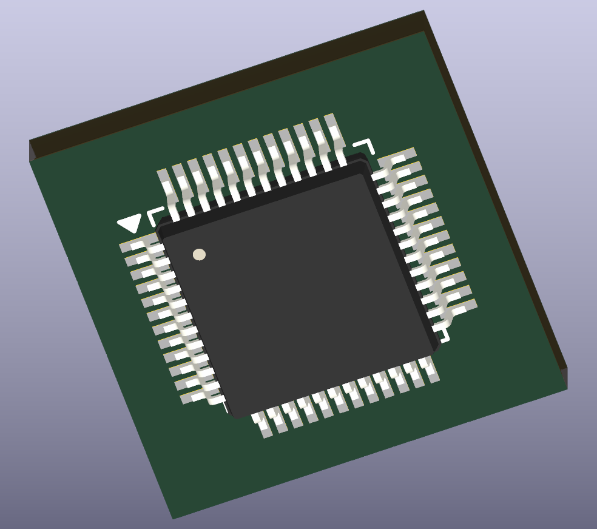
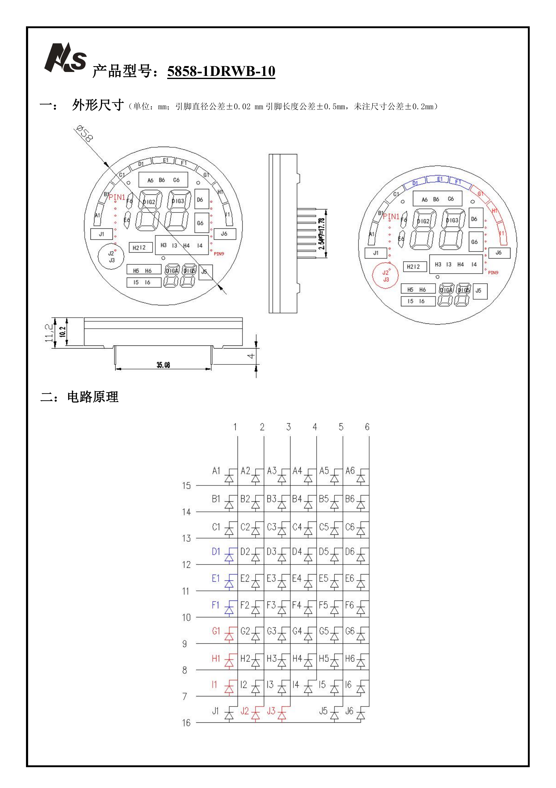

# 晶振与封装说明

本文记录 STM32C562 LQFP48、24MHz HSE 和 58mm 圆屏所用的项目封装。

## STM32C562 LQFP48

U401 使用 `SSD:STM32C562CET6_LQFP48_ST`，尺寸依据 ST DS14927 的 LQFP48 推荐焊盘。

| 项目 | 参数 |
| --- | --- |
| 本体 | 7×7mm |
| 引脚数量 | 48 |
| 引脚间距 | 0.50mm |
| 铜焊盘 | 1.20×0.30mm |
| 相对两排焊盘中心距离 | 8.50mm |
| 铜焊盘最外沿跨度 | 9.70mm |
| 铜焊盘最内沿间距 | 7.30mm |
| 中央散热焊盘 | 无 |

顶视图脚号排列：1～12 沿左侧向下，13～24 沿下侧向右，25～36 沿右侧向上，37～48 沿上侧向左。

  

- [MCU 尺寸图与 1:1 对位图](../review/mcu_footprint_dimensioned.pdf)
- [MCU 3D 模型原图](../review/mcu_footprint_3d.png)
- [焊盘引脚与坐标](../review/STM32C562CET6_焊盘引脚核对.csv)

MCU STEP 模型位于 `libraries/SSD.3dshapes/`，通过 `${KIPRJMOD}` 相对路径引用。

## 24MHz HSE

| 器件 | 参数与连接 |
| --- | --- |
| Y401 | Abracon ABM8-24.000MHZ-10-D2Y-T，24MHz，CL=10pF |
| Y401-1 | PH0-OSC_IN |
| Y401-3 | PH1-OSC_OUT |
| Y401-2/4 | GND |
| C407/C408 | 6.8pF，C0G，0603 |

Y401 使用 `SSD:Abracon_ABM8_3.2x2.5mm` 封装，四个焊盘尺寸为 1.30×1.05mm，中心距为 2.30×1.75mm。1、3 脚是晶体端，2、4 脚连接外壳地。

晶体标称 ESR 不高于 50Ω，C0 不高于 3pF，最大驱动功率 100µW。STM32C562 内置振荡反馈电阻，外部不安装 1MΩ 反馈电阻。

固件将 HSE 配置为晶体模式，等待 HSE 就绪后再切换系统时钟。

## 圆屏封装

DS201 使用 `SSD:ALS5858_1DRWB_10`。

| 项目 | 参数 |
| --- | --- |
| 外径 | 58mm |
| 引脚 | 16，左右各 8 脚 |
| 同排针距 | 2.54mm |
| 两排间距 | 35.08mm |
| 同排首尾跨度 | 17.78mm |
| 焊盘直径 | 1.8mm |
| 钻孔 | 1.0mm |
| 标称单边焊环 | 0.40mm |

1 脚使用方形焊盘，位于正视图左上角。左排由上到下为 1～8，右排由下到上为 9～16。

  

- [圆屏 1:1 对位图](../review/display_footprint_1to1.pdf)
- [显示屏规格书](../../../docs/20250303远帆5858-1DRWB-10%281%29.pdf)
- [显示屏光电参数预览](../../../docs/media/reference/display-spec-optical-electrical.png)
- [圆屏实物点亮照片](../../../docs/media/photos/display-lit-dark.jpg)

显示屏 STEP 模型位于 `libraries/SSD.3dshapes/ALS5858_1DRWB_10.step`。
